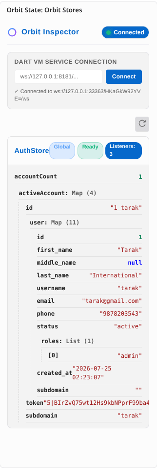

# Orbit Flutter State Management - VSCode Extension

Snippets and store generators for [Orbit](https://pub.dev) — a lightweight, zero-boilerplate Flutter state management library.

---

## Features

### 🔍 Orbit State Inspector Sidebar
Provides a **real-time live preview** of state trees for **both Global singletons and Scoped store instances** during your Dart/Flutter debug sessions.
- **Real-Time Updates**: Instantly reflects state changes and mutations as they happen in your app.
- **Global & Scoped Support**: Full visibility into app-wide singletons as well as widget-subtree scoped stores (`OrbitScope`).
- **Automatic Disambiguation**: Differentiates multiple active scoped instances of the same store class using unique instance identifiers (`StoreName (#hex)`).
- **Zero Configuration**: Connects automatically to running Flutter debug sessions via the Dart VM Service.



> **Note — listener count in console logs vs. the State Inspector**
>
> The `notified N listeners` figure in console logs is captured at the exact instant `mutate()` is called — it is a historical snapshot of how many listeners were attached *at that moment*. The **Listeners** badge in this extension's inspector reflects the live count at the time of the polling request (~150 ms later). By then additional `OrbitBuilder`/`OrbitSelector` widgets may have subscribed in response to the notification, so the two numbers can legitimately differ. Both are accurate — they just measure different points in time.

### 🚀 Snippets
Type any of the following prefixes in `.dart` files:

| Prefix | Inserted Template |
| :--- | :--- |
| `os-store` | Complete `OrbitStore` class declaration with state getters, `mutate()`, and `defineStore()` reference. |
| `os-store-full` | `OrbitStore` declaration with `init()`, `onResume()`, `onDispose()`, `mutate()`, and `snapshot()`. |
| `os-builder` | `OrbitBuilder<MyStore>(store: ..., builder: ...)` widget tree listener. |
| `os-builder-child` | `OrbitBuilder` with static `child` subtree re-use optimization. |
| `os-ref-builder` | `myStore.builder(builder: ...)` direct helper call on `OrbitStoreRef`. |
| `os-selector` | `OrbitSelector<MyStore, Slice>(store: ..., selector: ..., builder: ...)` selective re-render widget. |
| `os-ref-select` | `myStore.select(selector: ..., builder: ...)` direct helper call on `OrbitStoreRef`. |
| `os-scope` | `OrbitScope<MyStore>(create: () => ..., child: ...)` subtree scope widget. |
| `os-context` | `final store = context.orbit<MyStore>();` scoped store context lookup and listener subscription. |
| `os-context-read` | `final store = context.orbitRead<MyStore>();` store context lookup without rebuilding. |
| `os-mutate` | `mutate(() => ...);` mutation state change. |
| `os-mutate-async` | `await mutate(() async { ... });` asynchronous mutation wrapper. |
| `os-observe` | `Orbit.observe((store, mutation) { ... })` global mutation middleware listener. |
| `os-computed` | `final computed = defineStore(() => ComputedStore<T>(...))` derived store setup. |
| `os-future-provider` | `final futureProvider = defineStore(() => FutureProvider<T>(...))` async Future store setup. |
| `os-stream-provider` | `final streamProvider = defineStore(() => StreamProvider<T>(...))` async Stream store setup. |
| `os-debounce` | `debounce(id, duration, action)` inside OrbitStore with auto-disposal timer safety. |
| `os-throttle` | `throttle(id, duration, action)` inside OrbitStore with auto-disposal timer safety. |

---

## 🛠️ Commands
- **`Orbit: Create OrbitStore`**: Right-click any folder in Explorer or open the Command Palette (`Ctrl+Shift+P` / `Cmd+Shift+P`) and type `Orbit: Create OrbitStore`. Enter a store name (e.g. `User`, `Cart`, `UserProfile`), and a pre-filled `user_profile_store.dart` file will be generated automatically.

---

## Installation

To install locally for development or testing in VSCode:

```bash
cd vscode-extension
npx vsce package
code --install-extension orbit-flutter-1.4.0.vsix
```
